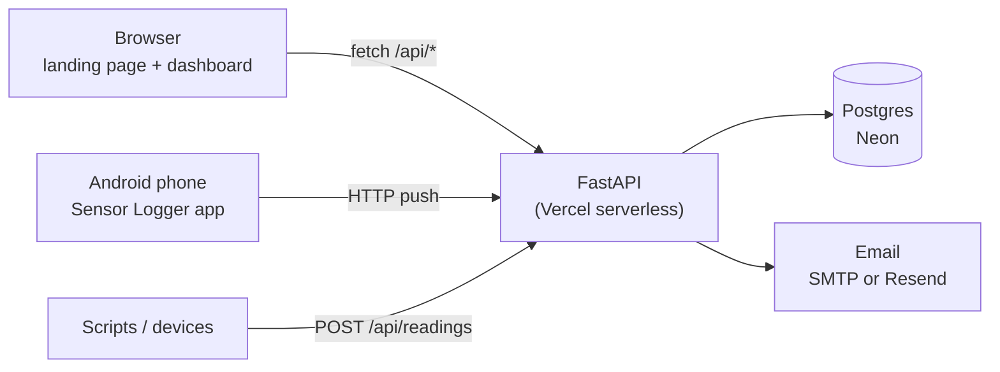

# FreshCheck

**Know your temperature. Protect your food.**

FreshCheck is a concept for a subscription service that continuously monitors the temperature of food in storage and delivery and alerts a business the moment something leaves its safe range, instead of the next morning. This repository is the working prototype: a marketing site, account system, and a live monitoring dashboard that can run on simulated data or on **real readings from a phone**.

**Live demo:** https://fresh-check-tt.vercel.app

> **Status:** prototype / demo. The dashboard's built-in sensors are simulated. Real readings are supported through an API and an Android app, but this is not a production food-safety system. Do not rely on it for compliance.

---

## Contents

- [The idea](#the-idea)
- [Features](#features)
- [How it works](#how-it-works)
- [Tech stack](#tech-stack)
- [Project structure](#project-structure)
- [Run it locally](#run-it-locally)
- [Configuration](#configuration)
- [Deploy to Vercel + Neon](#deploy-to-vercel--neon)
- [Using a real sensor](#using-a-real-sensor)
- [API reference](#api-reference)
- [Design decisions](#design-decisions)
- [Security notes](#security-notes)
- [Known limitations](#known-limitations)
- [Roadmap](#roadmap)

---

## The idea

Restaurants, supermarkets, caterers and distributors often find out about a failed fridge only after the food is compromised. Manual temperature checks tell you the temperature *at the moment of the check*.

FreshCheck's pitch: sensors send readings to a cloud platform, a dashboard shows every fridge, freezer, cold room and delivery vehicle in real time, and an alert goes out as soon as a reading leaves the safe range. The planned business model is a monthly subscription (the landing page shows Starter, Business and Enterprise plans, priced in TT$ for Trinidad and Tobago).

## Features

**Marketing site** (`/`)
- Responsive landing page with a scroll-driven photo background
- Interactive **live demo** that simulates a fridge failure and the resulting alert
- **Food-waste cost calculator** that compares estimated losses to the cost of a plan
- Pricing, "who it's for", and a demo-request form
- A small FAQ chatbot (canned answers, no AI backend)

**Accounts**
- Request a demo, then choose a password and you're signed in to your own dashboard
- Sign in, **forgot/reset password** by emailed one-time link, and a welcome email on sign-up
- Sessions use an httpOnly cookie

**Dashboard** (`/dashboard`)
- Stat cards: active alerts, online units, vehicles in transit, 7-day compliance, estimated stock saved
- **Sensor list** with search and Alerts / Vehicles filters
- Per-sensor details: current temperature, min/avg/max, chart with the safe range shaded, **6h / 24h / 7d** views
- **Acknowledge alerts**, and the bell icon jumps to the sensor that raised the alert
- **Editable safe range** per sensor, with the whole dashboard recalculating instantly
- Analytics: alerts per day (last 7 days), compliance by unit, alert history
- **CSV export** with a picker for which sensors and which period (6h / 24h / 7d)
- **Light mode** (photo background, matching the site) and **dark mode**
- Simulated sensors are seeded per account and adapt to the business type chosen at sign-up

**Live sensors (real data)**
- **Add sensor** in two modes: *Simulated* (type a name and temperature) or *Real sensor (phone)*
- Live sensors appear in the same list, charts, alert counts and history as everything else
- **Email alerts** when a live sensor leaves its safe range, once per episode, plus a **"back to normal" email** (with how long the alert lasted) when it recovers
- Remove a sensor and its readings at any time

**Admin** (`/admin`)
- Private list of everyone who requested a demo: business, type, email, status, live-reading activity
- Search, CSV export, and delete (removes the account and its data)
- Access is limited to emails listed in `ADMIN_EMAILS`

## How it works



- The front end is plain HTML, CSS and JavaScript in `public/` with no build step. Charts are inline SVG.
- The API is a single FastAPI app deployed as one Vercel function. Static files are served by Vercel's CDN.
- Data lives in Postgres (Neon). Three tables are created automatically on startup: `demouser`, `dashstate` (per-user dashboard settings as JSON) and `reading` (temperature readings).
- The dashboard polls for new readings every 4 seconds and merges them into its in-memory history.

## Tech stack

| Layer | Technology |
|---|---|
| Front end | HTML, CSS, vanilla JavaScript, inline SVG charts, Google Fonts (Bricolage Grotesque, JetBrains Mono) |
| Back end | Python, [FastAPI](https://fastapi.tiangolo.com/), [SQLModel](https://sqlmodel.tiangolo.com/), Pydantic |
| Database | Postgres on [Neon](https://neon.tech/) (SQLite for local development) |
| Auth | argon2 password hashing (`pwdlib`), JWT in an httpOnly cookie (`PyJWT`) |
| Email | Any SMTP server (e.g. Gmail app password) or [Resend](https://resend.com/), using only the standard library |
| Hosting | [Vercel](https://vercel.com/) |
| Real sensor | [Sensor Logger](https://github.com/tszheichoi/awesome-sensor-logger) (Android) |

## Project structure

```
.
├── api/
│   └── index.py          # Vercel entry point: exposes the FastAPI app
├── backend/
│   ├── main.py           # All API routes and alert/email logic
│   ├── models.py         # DemoUser, DashState, Reading
│   ├── config.py         # Settings loaded from environment variables
│   ├── database.py       # Engine and session (Postgres or SQLite)
│   ├── security.py       # Password hashing and JWT helpers
│   └── mailer.py         # send_email() via SMTP or Resend
├── public/
│   ├── index.html        # Landing page
│   ├── dashboard.html    # Demo dashboard
│   ├── admin.html        # Admin: demo requests
│   ├── favicon.svg
│   └── img/              # Background photos
├── .env.example          # Template for local configuration
├── requirements.txt
└── vercel.json           # Clean URLs and security headers
```


## Using a real sensor

There are two ways to send real temperature readings. Both end up in the same dashboard.

> **A note on phones:** most phones have no room-temperature sensor. The Android *battery temperature* used below is the **phone's own temperature** (typically 25–35 °C, and it rises while charging), not the temperature of the room. It's a great way to demo the full pipeline; for real fridges use dedicated hardware.

### Option 1: Android phone with Sensor Logger (no code)

1. On the dashboard click **＋ Add sensor**, choose **Real sensor (phone)**, set a name and safe range (a sensible default is prefilled), and click **Show setup details**. You'll get a **Push URL** and an **Auth Header** with Copy buttons.
2. In the [Sensor Logger](https://github.com/tszheichoi/awesome-sensor-logger) app open **Settings → Data Streaming**, turn on **Enable HTTP Push**, and paste the Push URL and Auth Header.
3. Turn on the **Battery Temperature** sensor and tap **Tap to Test Pushing**.
4. **Start a recording** and keep it running. The sensor appears on the dashboard as soon as the first reading arrives.

Sensor Logger's free tier pushes about once a second. The server keeps the database light by storing at most **one reading every 30 seconds**, except when a reading crosses the safe range, which is always stored immediately so alerts are never delayed. Errors (wrong key, sensor removed, sensor limit) are returned with HTTP 499 and a plain-text message, which Sensor Logger shows to the user.

### Option 2: Any device or script

Every account has a **device key**. Send readings with an HTTP POST:

```bash
curl -X POST https://YOUR-SITE.vercel.app/api/readings \
  -H "Content-Type: application/json" \
  -H "X-API-Key: YOUR_DEVICE_KEY" \
  -d '{"sensor":"Kitchen Fridge","temperature":3.4}'
```

PowerShell:

```powershell
Invoke-RestMethod -Method Post -Uri https://YOUR-SITE.vercel.app/api/readings `
  -Headers @{"X-API-Key"="YOUR_DEVICE_KEY"} -ContentType "application/json" `
  -Body '{"sensor":"Kitchen Fridge","temperature":3.4}'
```

This is the route an ESP32 with a temperature probe, or a small relay for a Bluetooth sensor, would use. The device key is shown in the Add sensor popup (real-sensor tab). Treat it like a password.

> The demo limits each account to **one live sensor**, and keeps readings for 7 days.


## Design decisions

- **One email per alert episode.** The server records which sensors it has already emailed about and clears the flag when the sensor recovers. This is tracked explicitly, instead of being inferred from the previous reading, so changing a safe range while a sensor is already out of range still produces an alert email.
- **Recovery emails** say how long the sensor was out of range. Readings older than 10 minutes never trigger an email.
- **Downsampling at the edge.** High-frequency pushes are cheap to reject: a short in-memory cache (20 s) holds each sensor's range and last stored reading, so most pushes touch the database zero times. Whenever something does need storing, the server re-reads the account first, so a removed or paused sensor can never be resurrected by a stale cache.
- **Removing a sensor pauses its phone feed** until it's added again, so a phone that keeps pushing doesn't silently recreate it.
- **Device keys are derived, not stored.** A key is `HMAC(SECRET_KEY, user id)`, so no extra column or table is needed. Changing `SECRET_KEY` revokes every key.
- **Time-based charts.** Simulated and live sensors share one time-series model, so readings that arrive minutes apart are plotted at the right spacing, and a young sensor's chart zooms to the data it has.
- **No framework on the front end.** Three static pages, a few hundred lines of JavaScript each, inline SVG. It deploys anywhere that can host static files.

## Security notes

- Passwords are hashed with argon2. Sessions are JWTs in an httpOnly, SameSite=Lax cookie (HTTPS-only in production).
- Setup and reset links are signed, short-lived (30 minutes) and purpose-bound; a reset link stops working after the password changes.
- The "forgot password" reply doesn't reveal whether an account exists.
- Admin routes check the signed-in user's email against `ADMIN_EMAILS` on the server. The `/admin` page itself is just a static file.
- User-supplied text (sensor names, business names) is escaped before it's rendered.
- `vercel.json` sets `X-Content-Type-Options: nosniff` and `X-Frame-Options: DENY`.
- Never commit `.env`. Rotate `SECRET_KEY` if a device key or secret is exposed.

## Known limitations

- It's a demo: no payment, no real multi-tenant onboarding, one live sensor per account.
- No rate limiting on sign-up, sign-in or the reading endpoints.
- Device keys can't be rotated individually (only all at once, via `SECRET_KEY`).
- The ingest cache is per serverless instance. It only affects efficiency, never correctness.
- The dashboard loads at most 5,000 readings from the past 7 days per account.
- Safe ranges for live sensors apply per sensor name; sensor names are case-sensitive.
- Browser cookies are the only session mechanism (no API tokens for users).
- There is no automated test suite yet.

## Roadmap

- Rate limiting and per-user, rotatable API keys
- More than one live sensor, with grouping by location
- Dedicated hardware path (for example ESP32 + probe, or Bluetooth sensors via a relay)
- Alerts by SMS or WhatsApp, and escalation rules
- Automated tests and CI
- Real subscriptions and billing

---

*FreshCheck: because knowing your food is safe shouldn't depend on checking it too late.*
